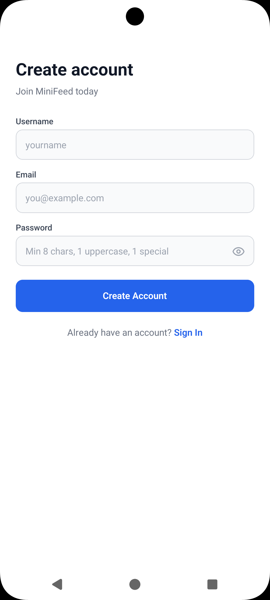
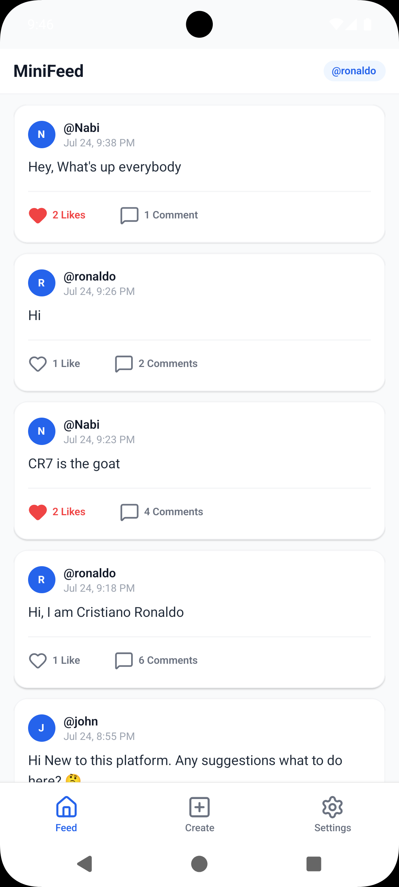
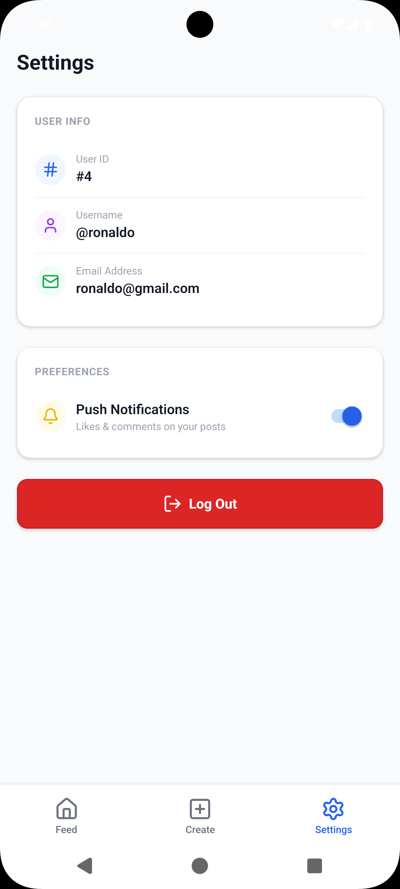

# MiniFeed

MiniFeed is a fast, full-stack, mobile-first social feed application featuring real-time activity updates, post creation, a full-featured liking/commenting system, and push notifications powered by Firebase Cloud Messaging (FCM).

Built using a modern TypeScript tech stack, the app targets Android and iOS with Expo and runs a robust backend server with Express, PostgreSQL (via Sequelize ORM), and Firebase Admin.

---

## Screenshots

Here is a preview of the MiniFeed mobile experience:

<div align="center">
  
  
  
</div>

---

## Key Features

- **Sleek Bottom Sheets**: Facebook/Instagram-style comment modals with springy physics and intelligent safe-area padding that stays flush above the keyboard.
- **Firebase Push Notifications**: Real-time push notifications sent directly to users' devices when someone likes or comments on their posts.
- **Notification Preferences**: A toggle in the Settings screen allowing users to easily subscribe/unsubscribe from push alerts.
- **Auth & Security**: Strong password validations (enforcing uppercase, lowercase, numbers, and special characters) with built-in password visibility show/hide toggles.
- **Global State Management**: Redux Toolkit configuration on the frontend utilizing RTK Query for caching, automatic fetching, and mutation tracking.
- **Edge-to-Edge Design**: Full compatibility with modern Android/iOS edge-to-edge layouts, including dynamic safe-area paddings for navigation and status bars.

---

## Tech Stack

### Frontend (Mobile App)

- **Framework**: React Native & Expo (SDK 57)
- **Navigation**: Expo Router (File-based navigation)
- **State Management**: Redux Toolkit & RTK Query
- **Icons**: Lucide React Native
- **Styling**: NativeWind (Tailwind CSS v4)
- **Language**: TypeScript

### Backend (Server API)

- **Runtime**: Node.js
- **Framework**: Express.js
- **Database**: PostgreSQL (hosted on NeonDB)
- **ORM**: Sequelize (v6)
- **Push Notifications**: Firebase Admin SDK (v14)
- **Language**: TypeScript (using `tsx` for execution)

---

## Getting Started

### Prerequisites

- Node.js (v18+)
- Android Emulator, iOS Simulator, or a physical test device with the Expo Go app.

---

### 1. Backend Setup

1. Navigate to the backend directory:

   ```bash
   cd minifeed-backend
   ```

2. Install dependencies:

   ```bash
   npm install
   ```

3. Create a `.env` file in the root of `minifeed-backend`:

   ```env
   PORT=3001
   DATABASE_URL=your_postgres_connection_string
   JWT_SECRET=your_jwt_secret_key
   JWT_EXPIRES_IN=7d
   ```

4. Place your Firebase Admin Service Account credentials file (`firebase-service-account.json`) directly in the `minifeed-backend/` root directory to activate push notifications.

5. Start the backend developer server:
   ```bash
   npm run dev
   ```

---

### 2. Frontend Setup

1. Navigate to the app directory:

   ```bash
   cd minifeed-app
   ```

2. Install dependencies:

   ```bash
   npm install
   ```

3. Configure your API Endpoint. By default, the app points to `http://localhost:3001` or your local IP address configured in the RTK Query configuration.

4. Place your client `google-services.json` inside the `minifeed-app/` root directory.

5. Perform a clean prebuild to generate native Android and iOS folders incorporating the Firebase configurations:
   ```bash
   npx expo prebuild --clean
   ```

6. Run the native build on a device or emulator:
   * **For Android (Device/Emulator)**:
     ```bash
     npx expo run:android
     ```
   * **For iOS (Device/Emulator)**:
     ```bash
     npx expo run:ios
     ```
   * **To run directly on a physical device**:
     ```bash
     npx expo run:android --device
     ```
     *(Make sure your physical device is connected via USB and USB Debugging is enabled)*

---

## Project Architecture

```
MiniFeed/
├── assets/                     # App screenshots & design assets
│   └── screenshots/
├── minifeed-app/               # Expo (React Native) Frontend
│   ├── src/
│   │   ├── app/                # File-system router pages
│   │   ├── components/         # Reusable UI components (Modals, Cards)
│   │   └── store/              # Redux store & API slices
│   └── app.json                # Expo config (incl. FCM credentials)
└── minifeed-backend/           # Express (Node.js) Backend
    ├── src/
    │   ├── config/             # DB and Firebase config
    │   ├── controllers/        # Express request handler logic
    │   ├── middleware/         # Auth & validation middlewares
    │   ├── models/             # Sequelize database models
    │   └── routes/             # API routing endpoints
    └── firebase-service-account.json
```

---

## Security & Best Practices

- **Hashing**: User passwords are encrypted with bcrypt (12 rounds) before being saved to PostgreSQL.
- **FCM Sanitation**: Clears FCM tokens on the server immediately when a user logs out or disables notifications from settings.
- **Eager Loading**: Sequelize queries utilize optimal aliasing and include constraints to ensure clean database transactions.
